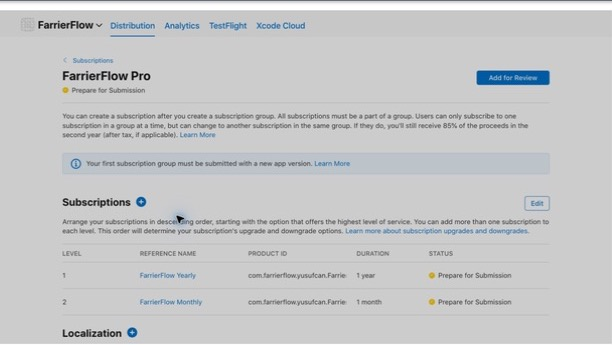
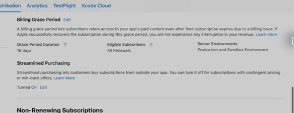

# StoreKit Configuration

## RevenueCat production overlay

`FarrierFlow.storekit` remains the checked-in Apple product-contract fixture;
production purchases are performed by RevenueCat. The project resolves the
stable `RevenueCat` package product (not `RevenueCatUI`) and reads the public
Apple SDK key from `RevenueCatPublicSDKKey`, processed by
`FarrierFlow/Info.plist` from the `REVENUECAT_PUBLIC_SDK_KEY` build setting. The
repository stores no dashboard credential or secret.

Resolution on 2026-08-28 selected stable Purchases iOS `5.87.1` (revision
`b65cae4f227be800c57cb9700dbd94f2aa5409b2`) after querying current upstream
tags and resolving with Xcode 26.6 / Swift 6.3.3 for the iOS 18 deployment
target. `Package.resolved` is the exact reproducibility record.

Production setup was completed on 2026-08-28: the RevenueCat Apple app uses the
existing bundle ID; both products are attached to entitlement `pro`; the
current Offering contains one monthly and one annual package; the App Store
In-App Purchase key and public Apple SDK key are configured; anonymous App User
IDs remain; restore behavior remains `Transfer to new App User ID`; and
RevenueCat validates the Apple App Store Server Notification URL as correctly
configured. Receipt-delivery acceptance still depends on the separately
scheduled Apple sandbox/TestFlight lifecycle run.

## Local Xcode configuration

`FarrierFlow/Resources/FarrierFlow.storekit` is the checked-in StoreKit
Testing configuration for the FarrierFlow scheme's Run action. It was created
with Xcode's StoreKit Configuration editor and contains exactly one
auto-renewable subscription group:

| Group | Product | Identifier | Price | Duration | Introductory offer |
| --- | --- | --- | --- | --- | --- |
| FarrierFlow Pro | FarrierFlow Yearly | `com.farrierflow.yusufcan.FarrierFlow.pro.yearly` | USD 119.99 | 1 year | Free for 2 weeks (14 days) |
| FarrierFlow Pro | FarrierFlow Monthly | `com.farrierflow.yusufcan.FarrierFlow.pro.monthly` | USD 14.99 | 1 month | Free for 2 weeks (14 days) |

The localized group display name is `FarrierFlow Pro`. The product display
names are `FarrierFlow Yearly` and `FarrierFlow Monthly`. Family Sharing is
off. The configuration contains no offer codes, promotional offers, win-back
offers, or additional products. Application display order is yearly first,
then monthly, through `SubscriptionProduct.orderedIdentifiers`.

The Xcode editor represents the approved 14-day trial as the StoreKit period
`P2W` (two weeks).

## Local StoreKit acceptance

Acceptance was exercised with Xcode's Run action on the recorded iPhone 17 Pro
(iOS 26.5) simulator so the checked-in StoreKit configuration was active.
Observed behavior:

- With no current entitlement, the app remained read-only and existing local
  business records remained visible.
- The yearly product displayed a two-week free trial followed by USD 119.99 per
  year. Starting the trial granted full access.
- Re-enabling renewal produced an active paid yearly transaction. Canceling
  renewal while the transaction was still paid through preserved full access.
- Accelerated monthly renewals produced successive current transactions. After
  the current transaction was refunded and revoked, the app returned to
  read-only access.
- Restore with no valid current entitlement did not grant access.
- A subsequent monthly purchase restored full access on a clean relaunch through
  `Transaction.currentEntitlements`.
- After resetting only Xcode's simulated transaction history, the monthly
  product displayed and granted its two-week introductory trial.
- Xcode's transaction inspector recorded the billing boundary explicitly: the
  trial expired, the grace-period expiration followed, and billing retry ended
  after grace. The native Billing Problem sheet owns the simulator foreground
  while this state is active, so the transaction inspector is the acceptance
  evidence for the grace interval.
- A clean launch while the transaction was in billing retry outside grace was
  read-only. Existing records remained visible.

The accelerated renewal run generated a large transaction-update backlog, so
the final resubscription was not reflected by the already-running process before
relaunch. This was a StoreKit test-session artifact: the configured relaunch
immediately resolved the current transaction and granted access.

The simulated transaction ledger was empty and the checked-in configuration was
returned to real-time renewal with billing-issue and grace simulation disabled
after acceptance.

Representative SwiftData counts matched before and after the access-only state
transitions: one BusinessProfile, Client, Barn, Horse, Appointment, Visit, and
Service; zero Photograph and Invoice records. The production
`HoofPhotographs` directory contained zero files both before and after. No app
container or business data was reset.

## App Store Connect acceptance

The App Store Connect configuration mirrors the local StoreKit contract:

- App name: `FarrierFlow`
- App Apple ID: `6800424289`
- SKU: `farrierflow-ios`
- Bundle ID: `com.farrierflow.yusufcan.FarrierFlow`
- Primary language: English (U.S.)
- Subscription group: `FarrierFlow Pro` (`22302887`)
- Yearly subscription Apple ID: `6800424822`
- Monthly subscription Apple ID: `6800426059`

The yearly subscription is Level 1 and the monthly subscription is Level 2.
Both are available in the United States, use the prices shown in the local
configuration table, have Family Sharing off, and have English (U.S.) display
names with the description `Full access to FarrierFlow’s field workflow.`

Both products have a United States introductory offer that starts August 11,
2026, has no end date, and is free for the first two weeks. Billing grace is
enabled for 16 days for **All Renewals** in both production and sandbox.

On 2026-08-18, both products had a sanitized review screenshot uploaded and
each reported **Ready for Review**. Historical portal evidence recorded both
products as attached to the version 1.0 draft. A live read-only check on
2026-09-05 showed no in-app purchases or subscriptions attached to that
version, so both products and the group must be reattached before review.
Neither product nor the app version has been submitted. No credentials or
private account data are recorded in this repository.

Sanitized portal evidence excludes the account header and browser chrome:

